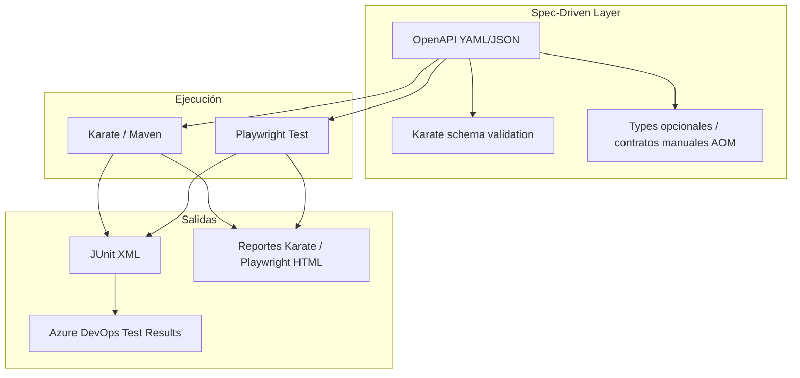

# Arquitectura del framework híbrido de automatización Backend

## Visión

Framework de demostración que combina **Spec-Driven Development (SDD)** con un stack híbrido **Karate + Playwright (TypeScript)** para cubrir regresión rápida de API y flujos complejos de negocio, orquestación y datos.

## Principios

| Principio | Implementación |
|-----------|----------------|
| Contrato como fuente de verdad | `openapi/` contiene (o referencia) el OpenAPI 3.x oficial; Karate valida respuestas contra esquemas derivados; los API Objects de Playwright alinean paths y modelos al mismo contrato. |
| Encapsulación tipo POM | **API Object Model (AOM)**: clases TypeScript por recurso (`PetApi`, `UserApi`) que exponen métodos de negocio, no URLs crudas en los tests. |
| Separación de responsabilidades | Karate: contratos, esquemas masivos, smoke/regresión rápida. Playwright Test: auth pesada, DB, flujos multi-paso, hooks programáticos avanzados. |

## Diagrama lógico

## Carpetas (resumen)

- `openapi/` — Contrato OpenAPI (versión controlada).
- `karate/` — Proyecto Maven, features `.feature`, utilidades y hooks declarativos.
- `playwright/` — Proyecto Node, AOM en `src/api`, hooks en `src/hooks`, tests en `tests`.
- `docs/` — Arquitectura, prompts para LLM, lineamientos OpenAPI, ChatOps.
- `azure-pipelines.yml` — CI/CD y publicación de resultados.

## Generación de casos con LLM (punto 4)

1. **Entrada**: historia de usuario + fragmento o URL del OpenAPI.
2. **Plantilla**: `docs/prompts/MASTER_PROMPT.md` estructura la salida en dos bloques: escenarios Karate (Gherkin + `match` de esquema) y tests Playwright (describe/it + llamadas AOM).
3. **Post-proceso humano**: revisar IDs, datos sensibles y tags; el pipeline valida que los archivos compilen y ejecuten.

## ChatOps y agentes (punto 5)

Ver `docs/CHATOPS_TEAMS.md`: patrón recomendado **Teams → Logic App / Power Automate → Azure DevOps REST API** (`runs`) con parámetros (`suite`, `branch`). Un agente LLM puede mapear lenguaje natural a esos parámetros y disparar el mismo endpoint.

## CI/CD (punto 6)

El pipeline ejecuta Maven (Karate) y npm (Playwright), recoge `**/TEST-*.xml` y `playwright/results/*.xml`, y usa `PublishTestResults@2` con `mergeTestResults: true` para una vista consolidada en Azure DevOps.
