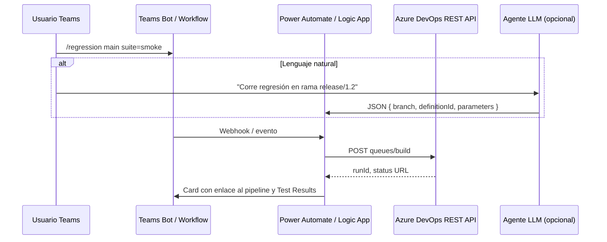

# ChatOps: ejecución de regresión desde Microsoft Teams

## Objetivo

Permitir que un equipo ordene ejecuciones de pruebas (Karate + Playwright) desde Teams mediante **comandos slash**, **mensajes en canal** o **lenguaje natural** interpretado por un agente.

## Arquitectura recomendada

## Componentes

1. **Teams**
   - **Messaging extension o Bot** registrado en Azure Bot Service, o **Workflow in Teams** que publique en un webhook.
   - Comandos explícitos: `/regression`, `/smoke`, con parámetros `branch`, `suite` (`karate`, `playwright`, `all`).

2. **Orquestador sin código**
   - **Power Automate** (HTTP trigger desde Teams) o **Azure Logic App** que reciba el payload y llame a Azure DevOps.

3. **Azure DevOps**
   - **REST API**: `POST https://dev.azure.com/{org}/{project}/_apis/build/builds?api-version=7.0`
   - Cuerpo mínimo: `definition` (pipeline id), `sourceBranch`, opcionalmente `templateParameters` o variables si el `azure-pipelines.yml` las lee (`RUN_KARATE`, `RUN_PLAYWRIGHT`).

4. **Agente de IA**
   - Recibe texto libre → extrae `rama`, `tipo de suite`, `entorno` → construye el JSON del paso 3.
   - Puede ejecutarse en **Azure Functions** + OpenAI, o **Copilot Studio** conectado al mismo flujo Power Automate.

## Seguridad

- PAT o **Workload Identity Federation** / **Managed Identity** en el conector hacia Azure DevOps, no credenciales en el mensaje de chat.
- Lista blanca de ramas y definiciones de pipeline permitidas para el bot.

## Mensaje de ejemplo al usuario

Tras encolar el build, el bot responde con tarjeta adaptativa: estado, enlace al run, y enlace directo a **Pipelines → Run → Tests** (pestaña integrada con `PublishTestResults`).
