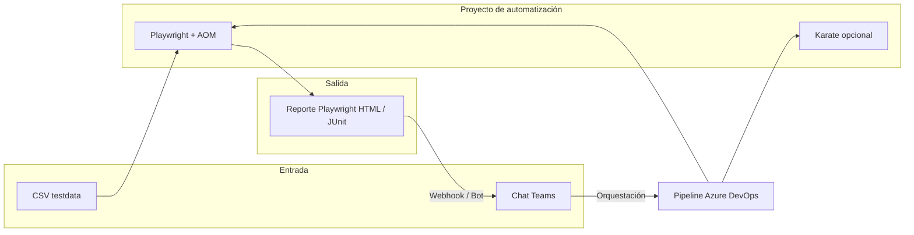

# Flujo equipo: CSV → automatización → reporte Playwright → Teams

Alineado al diagrama de trabajo (casos por CSV, disparo desde chat, reporte y vuelta al equipo).

## Vista general



## 1. Casos alimentados por CSV

- Archivo de datos: `playwright/testdata/pets-scenarios.csv`
- Parser reutilizable: `playwright/src/utils/csvFixtures.ts`
- Spec data-driven: `playwright/tests/pet.csv-driven.spec.ts`

Convención: primera fila = cabeceras; **no uses comas dentro de las celdas** (o amplía el parser).

Ejecutar solo lógica Playwright (incluye CSV + spec JSON):

```powershell
cd playwright
npm run test
```

Solo escenarios CSV:

```powershell
npm run test:csv
```

(o `npx playwright test pet.csv-driven.spec.ts`). En Azure DevOps puedes usar `PLAYWRIGHT_GREP=pet.csv-driven` si ajustas el pipeline a `--grep` por nombre de archivo vía proyecto; lo más simple es un stage separado que ejecute solo ese spec).

## 2. Solicitud desde Teams (“toda la suite o casos específicos”)

Patrón recomendado (detalle en `CHATOPS_TEAMS.md`):

1. Usuario o agente escribe en Teams: `/tests playwright` o `/tests csv` (definís los comandos).
2. **Power Automate / Logic App** recibe el webhook y llama a **Azure DevOps** `POST .../builds` con parámetros, por ejemplo:
   - `PLAYWRIGHT_GREP`: filtro de casos (vacío = todos).
   - `RUN_KARATE`: true/false.
3. El pipeline (`azure-pipelines.yml`) ejecuta Playwright y publica **Test Results** + artefacto **playwright-report**.

Variables de ejemplo en el pipeline (podés añadirlas al YAML):

```yaml
# templateParameters o variables
PLAYWRIGHT_GREP: ''  # ej. "data-driven" para solo CSV
```

Y en el paso de Playwright: `npx playwright test` con `--grep` si la variable viene informada.

## 3. Reporte Playwright

- Local: `cd playwright` → `npm run report` (abre `playwright-report/`).
- CI: artefacto `playwright-html-report` en Azure DevOps.

## 4. Vuelta al chat de Teams (cerrar el ciclo)

Opciones típicas:

**A — Enlace en tarjeta adaptativa**  
Al terminar el pipeline, Logic App lee el estado del run y envía a Teams un mensaje con:
- Estado (éxito / fallo)
- URL del run de pipeline
- URL del artefacto de reporte (descarga o portal de ADO)

**B — Incoming Webhook**  
Canal de Teams → **Conectores** → **Incoming Webhook**.  
Power Automate (al finalizar build) hace `POST` al webhook con JSON resumido:

```json
{
  "@type": "MessageCard",
  "summary": "Playwright terminado",
  "title": "Resultados API",
  "sections": [{
    "facts": [
      { "name": "Estado", "value": "Succeeded" },
      { "name": "Pipeline", "value": "https://dev.azure.com/..." }
    ]
  }]
}
```

**C — Bot + Graph**  
El bot publica el archivo o un resumen generado por el agente (LLM) a partir de `results.xml`.

## 5. Próximos pasos de producto

- Ampliar CSV con columnas `expectedHttp`, `tag`, etc.
- Pasar `PLAYWRIGHT_GREP` desde el mensaje de Teams al pipeline.
- Subir `playwright-report` zip al SharePoint/Teams Files y enlazar en la tarjeta.
